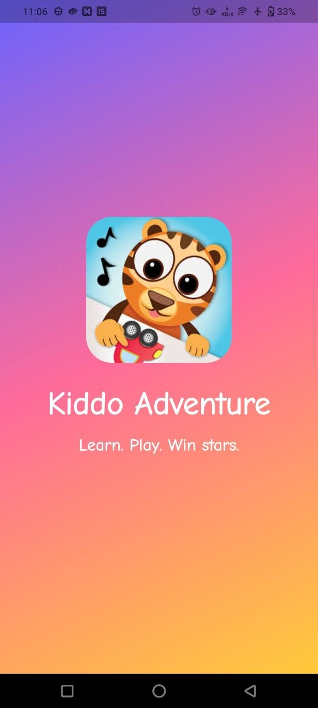
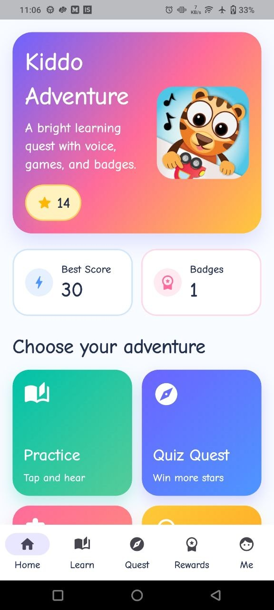
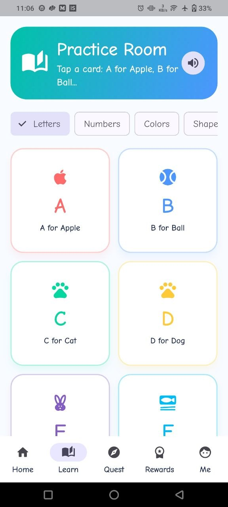
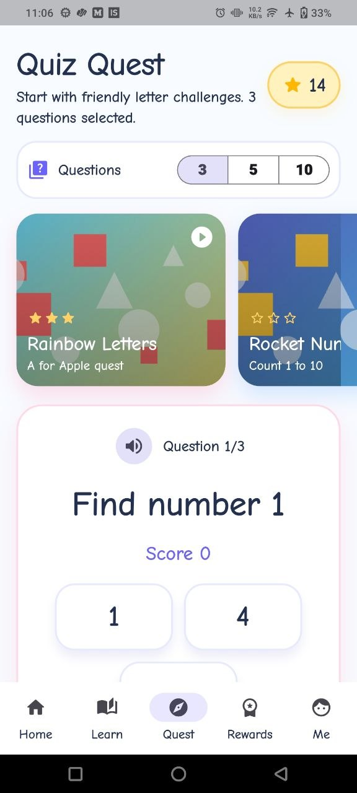
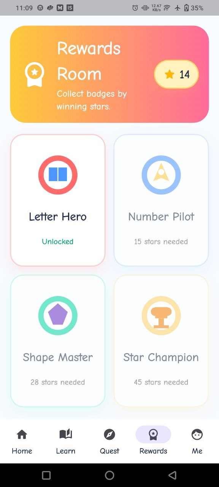
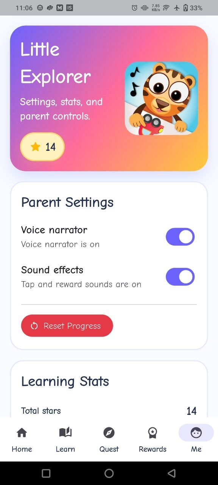

  

<h1 align="center">🎨 Kiddo: The Ultimate Learning Adventure 🚀</h1>

  <strong>A polished, interactive, and gamified learning experience designed for curious young minds.</strong>

  
  
  
  

---

## ✨ What is Kiddo?

Kiddo isn't just an app; it's a digital playground where education meets excitement! Built with a focus on visual excellence and smooth interactions, Kiddo helps children master foundational concepts through interactive play, audio feedback, and a highly rewarding gamified system.

---

## 🎯 Features & How They Work

Here is a deep dive into what makes Kiddo special and how kids interact with it:

### 🏠 The Home Hub (Dashboard)
The central command center for kids! From here, they can easily navigate to different sections like Practice, Quizzes, or the Rewards Gallery. The UI is designed with large, colorful buttons that are easy for little fingers to tap.

### 📚 Learning Zone (Practice Makes Perfect)
Before taking tests, kids need to learn! 
- **Interactive Tapping:** Kids can tap on different items, shapes, or animals on the screen.
- **Voice Enabled (TTS):** Using built-in Text-to-Speech, the app clearly pronounces the name of the item tapped, helping with word recognition and speech.

### 🧠 Challenge Time (Quizzes & Match Games)
Learning is tested through highly engaging mini-games:
- **Visual Quizzes:** Kids are asked to identify the correct object from multiple visually distinct options. 
- **Match Games:** Drag-and-drop or tap-to-connect gameplay where kids match related items (e.g., matching a shape to its silhouette).
- **Instant Audio Feedback:** A happy "Success" sound plays for correct answers, and a gentle "Try Again" sound plays for mistakes, keeping the environment positive.

### 🏆 Rewards System & Motivation
Kids thrive on positive reinforcement!
- **Earning Stars:** Every completed quiz or game rewards the child with stars.
- **Unlocking Badges:** Accumulating stars unlocks special, shiny badges in the Rewards Gallery.
- **Celebration Effects:** When a child hits a milestone or finishes a tough quiz, the screen fills with dynamic **Confetti** and **Lottie Animations** to celebrate their win!

### 📊 My Profile
A dedicated space just for them. The profile tracks their learning journey, displaying their current level, total stars collected, and an overview of their achievements so they can see how much they've grown.

---

## 📸 Visual Experience

Check out the vibrant and kid-friendly interface of Kiddo!

| **Splash & Entry** | **Home Hub** | **Learning Zone** |
|:---:|:---:|:---:|
|  |  |  |
| *Fun Beginnings* | *Central Command* | *Practice Makes Perfect* |

| **Challenge Time** | **Rewards Gallery** | **My Profile** |
|:---:|:---:|:---:|
|  |  |  |
| *Test Your Knowledge* | *Earn Those Badges!* | *Personalized for You* |

---

## 🛠️ Tech Stack & Architecture

Kiddo is built with modern tools to ensure stability, performance, and scalability.

<b>Click to expand Tech Stack</b>

- **Core Framework:** [Flutter](https://flutter.dev)
- **Language:** [Dart](https://dart.dev)
- **State Management:** Provider / Clean Architecture (Modularized)
- **Animations:** [Lottie](https://pub.dev/packages/lottie) & [Confetti](https://pub.dev/packages/confetti)
- **Audio Engine:** [AudioPlayers](https://pub.dev/packages/audioplayers)
- **Voice Synthesis:** [Flutter TTS](https://pub.dev/packages/flutter_tts)
- **Typography:** [Google Fonts (Inter & Outfit)](https://fonts.google.com)
- **Storage:** [Shared Preferences](https://pub.dev/packages/shared_preferences)

---

  Developed by <a href="https://github.com/MayureshTardekar">Mayuresh Tardekar</a>

